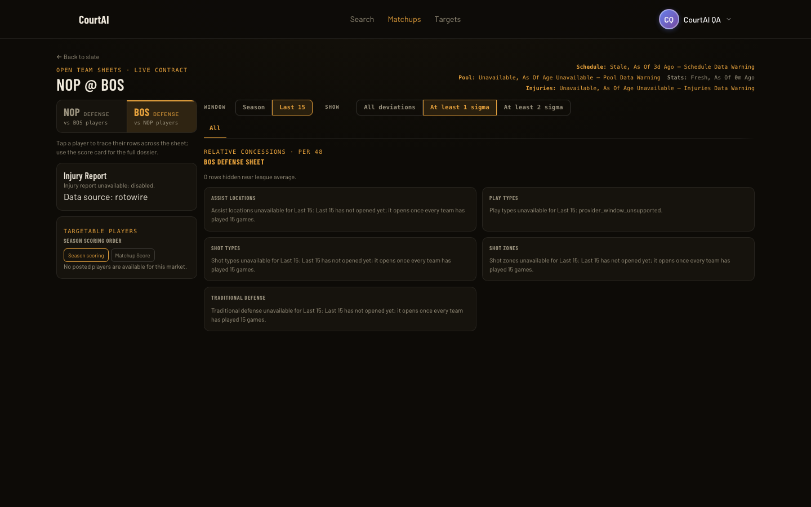
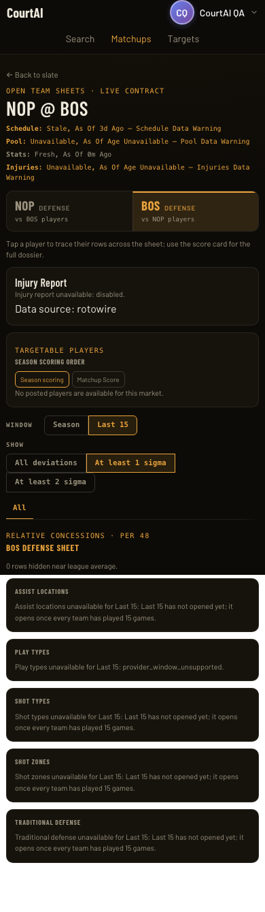
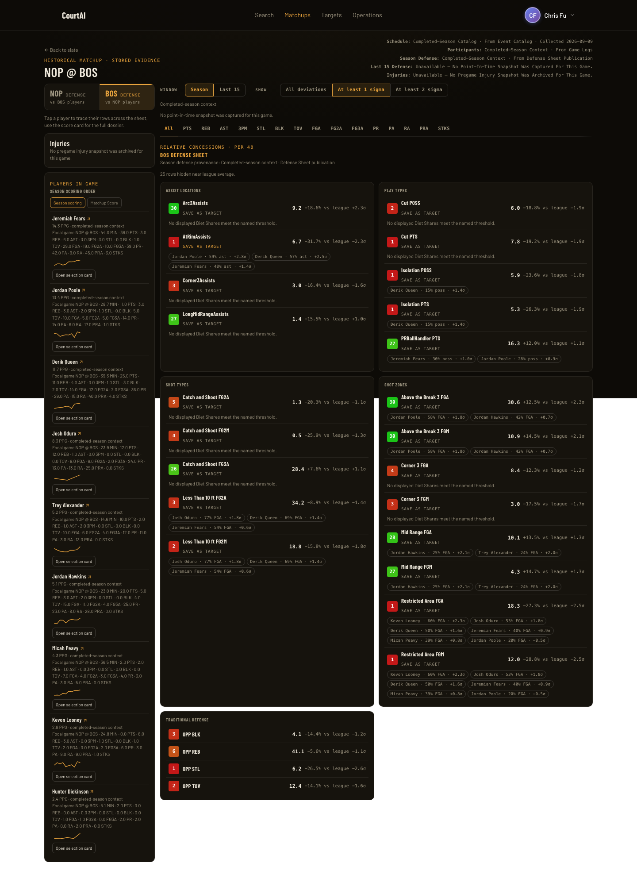
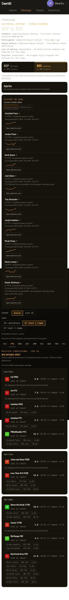

# StatsPlus #57 verification evidence

Implemented with OpenCode `opencode-go/deepseek-v4.1-flash`; fresh-context Standards and Spec reviews with Astra high. Final reviews have zero unresolved material findings.

| Source | Revision |
| --- | --- |
| Coordination | `54a4cb6fcb78b29d8ccc65c9859d54f50ee30ca5` |
| Backend final branch | `8169e780c9de1e7fb90928c393f9db4bdad08b9b` |
| Backend browser QA | `edc8aae412d189fe0a6cf0163f8e402c48011ef9` |
| Frontend implementation, review and browser | `65ec297b3bb899292d16d36f90ad7ce95a545e6a` |

The backend final commit adds only 47 lines/removes 4 in `tests/test_residential_collector.py`. Browser-tested application code is byte-identical to final HEAD. Final reviewed files also match HEAD byte-for-byte. Exact worktrees, fingerprints and commands are recorded in the individual bundles.

## Gates and review

- Backend `./scripts/check.sh`: 4,857 passed, 84.96% coverage, ruff clean, migrations idempotent, demo database valid.
- Frontend: `npm run lint`, `npm run format:check`, `npm run test:ci` (749 passed), `npm run build`, `npm run test:e2e` (109 passed, 2 existing skips).
- Coordination: `STATSPLUS_BACKEND_ROOT=$PWD/.statsplus/worktrees/backend STATSPLUS_FRONTEND_ROOT=$PWD/.statsplus/worktrees/frontend python3 scripts/check.py`: passed, 4 coordination tests and 13 endpoint contracts.
- Frontend review: [Standards](frontend-standards-1-result.md), [Spec and mutation evidence](frontend-spec-1-result.md).
- Backend review: [final Standards](backend-standards-4-result.md), [final Spec and mutation evidence](backend-spec-4-result.md). [Prior full Spec evidence](backend-spec-3-result.md) covers unchanged tests; its sole residual waiting-job test gap is closed in the final report.

## Separate browser verdicts

- [Historical QA: passed](qa-historical-final/verdict.md). Actual changed local backend, real Firebase authentication, disposable PostgreSQL sports snapshot; controls/reload/empty/error/recovery.
- [Controlled waiting-read QA: passed](qa-waiting-final/verdict.md). All four supported Last-15 bases display waiting sentences over old active publications; Season and play types preserved; desktop/phone controls, reload, Targets list/resolve 200 and empty page without alerts.
- [Production compatibility: passed](production-1/verdict.md). Local changed frontend with live Railway data and real auth, read-only historical journey. Deployed backend revision unknown. Production screenshots prove deployed compatibility, not undeployed backend behavior.

QA snapshot SHA-256: `3fe69266e135d9ed9e6f671d01e7034c7d529a6ee3a9fa6395851b003ee222f5`.

Every recorded command hash was checked against its retained JSONL. All sessions have `cleanedUp: true`; owned runtime directories are absent. Screenshots were visually inspected. Video remains in the local proof directories; published command/result metadata establishes action/result evidence without exporting auth storage or request headers.

## Coverage limits

The waiting browser scenario seeds only a disposable QA database; it is not a live early-season production observation. Catalog-bound offline tests separately drive 120 accepted NBA observations through real ingestion/composition to active, current-cutoff, exact-15 publications. The provider HTTP/outbox transport itself is not driven in that transition test.

Targets browser coverage uses an empty dedicated QA account. Populated withheld reason propagation and null readings have backend/decoder review evidence. The current Targets page no longer mounts the `L15 n/a` context component described in the issue; this predates this change and remains out of scope. Existing white background areas beyond the initial viewport in full-page captures are unchanged styling. QA disables provider integrations named in the repository verification skill; it does not exercise the Google sign-in popup.

## Screenshots

QA controlled waiting state:

Production-backed historical compatibility:

